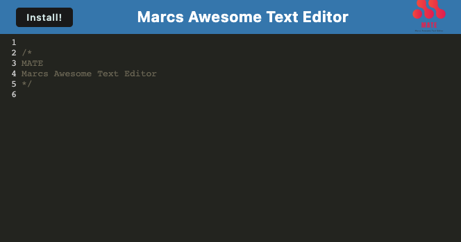
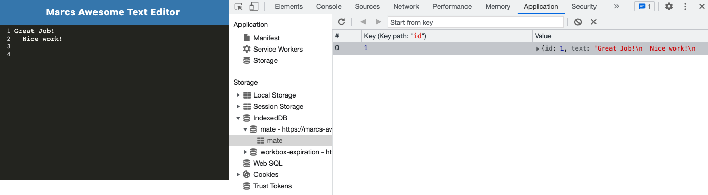
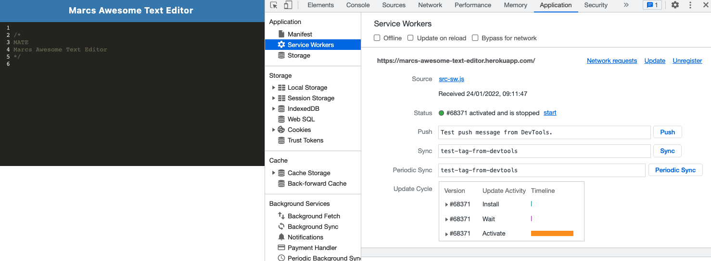

# MATE - Marcs Awesome Text Editor

---

## Table of Contents

1.  [Description](#Description)
2.  [Installation](#Installation)
3.  [Usage](#Usage)
4.  [License](#License)
5.  [Contributing](#Contributing)
6.  [Questions](#Questions)

 

## Description

This is a single page application that meets the PWA criteria. It features a number of data persistence techniques that serve as redundancy in case one of the options is not supported by the browser. This application will also function offline.
 

## Installation

Please clone the github repository and then run: `npm i` to install the dependencies and packages. Next you will ned to run `npm run build` to create the files needed. You maythen run either `npm run start:dev` or `npm run start`

  

## Usage

This awesome text editor is perfect for taking notes.

 

## License

This application has the following license:
[MIT License](https://opensource.org/licenses/MIT)

 

## Contributing

Please email me to discuss further.

 

## Questions

_If you would like to know more or have a question you'd like to ask, please contact me via email marc.malliate@gmail.com or you may also like to checkout my work [here](https://github.com/marcmalliate)_

 

### You may also like to view the GitHub repository which contains the code repository:

https://github.com/marcmalliate/MATE

 

### Screenshot of application:

When the app first loads:

The manifest.json file:

The indexedDB storage:

The service worker:

 

To view and test the deployed app visit: https://marcs-awesome-text-editor.herokuapp.com/

 

© _2021 Marc Malliate - Professional Readme Generator_
